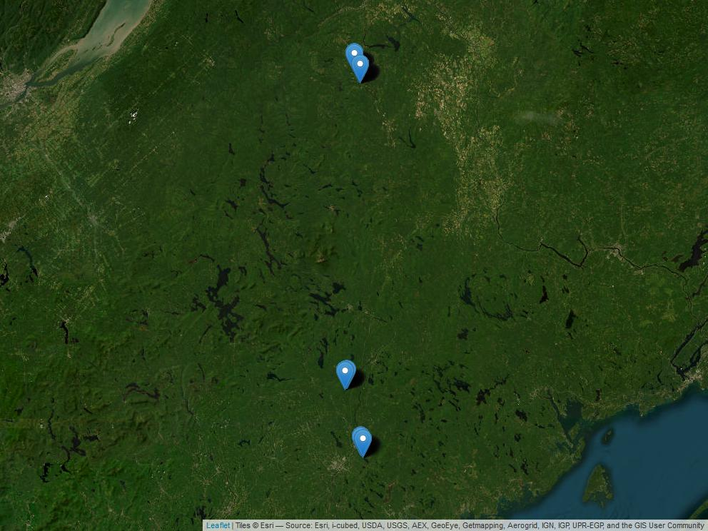
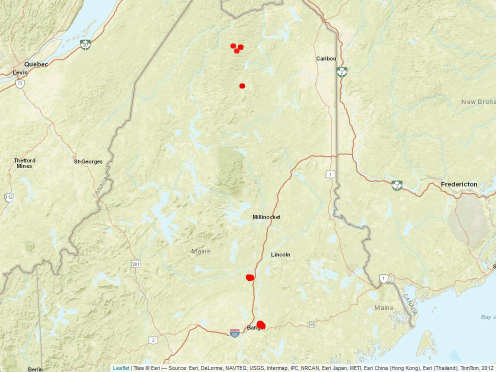
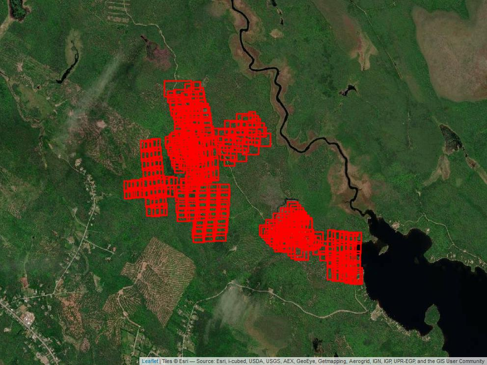

Tree Spectral Library
================

## Tree Spectral Library (treespectra)

The purpose of treespectra code is to take ground or image-based tree
reflectance spectra, build a classifier or regression ,and apply that
model to an imaging spectrometer data cube (aka hyperspectral image).

1\) First, install dependencies /Scripts/install_dependencies.R 2) Then
source the package of lecospectR /Functions/lecospectR.R

The functions in lecospectR are divided into sections, all of which are
loaded by sourcing /Functions/lecospectR.R

    /Functions/dataframe_operations.R  
    /Functions/model_support.R 
    /Functions/pfts.R  
    /Functions/pipeline.R  
    /Functions/raster_operations.R 
    /Functions/spectral_operations.R   
    /Functions/training_utilities.R    
    /Functions/type_conversion.R   
    /Functions/utilities.R 
    /Functions/validation.R    

## Ground spectra from Maine

1\) Ground spectra were collected around Maine.

2\) Locations where ground spectra were collected

\## How to run tree spectra

1\) Our workflow assumes a list of tree species from a table. This table
is used for several steps, including aggregating validation to the same
taxonomic level as training data. 2) Build a spectral library from a
range of field scans collected with Tungsten halogen illumination using
a leaf clip or contact probe. These scripts delete bad scans and
standardize the associated information into a single metadata format.
Around 90 vegetation indices are also calculated and the narrow band
reflectance is resampled and smoothed to 5 nm bands.

    /Scripts/2_DataMunging.R
    /Scripts/2B_DataMunging_missing_spectra.R   
    /Scripts/3_Create_SpecLibPSR.R

The output of running these scripts are two spectral libraries, one of
reflectance and one of vegetation indices along with the metadata for
these reflectance measurements.

    /Output/C_001_SC3_Cleaned_SpectralLib.csv
    /Data/D_002_SpecLib_Derivs.csv

3\) Collect spectra from pixels in UAV-captured images of tree canopies
that are visible in imagery. Stem maps of known tree locations are
overlaid on UAV flight path extents to identify canopy sources of
spectra (1_MSGC_extent, 2_MSGC_get_trees). Reflectance spectra are
extracted from hand-digitized tree canopies provided as a shapefile to
the script (3_crop_image_canopy_ROI). Each canopy is associated with
three hand-digitized shapefiles: 1) full canopy, 2) illuminated-only
branches, and 3) shaded-only branches. Cropping each image by the
shapefile creates a set of images with 326 bands from 400-1000nm, with
each image representing the spectral profile of one tree canopy. Script
(4_Parse_ROI_canopy_spectra) adds metadata to each pixel by tree species
and outputs a spectral library in wide format. Scripts
(5_Clean_image_spectra) and (6_Preprocess_viz_image) clean and process
data to facilitate the visualization of reflectance data by species.

    /Scripts/2_Image_processing/Headwall/1_MSGC_extent.R                     
    /Scripts/2_Image_processing/Headwall/2_MSGC_get_trees.R
    /Scripts/2_Image_processing/Headwall/3_Crop_image_canopy_ROI.R
    /Scripts/2_Image_processing/Headwall/4_Parse_ROI_canopy_spectra.R             
    /Scripts/2_Image_processing/Headwall/5_Clean_image_spectra.R
    /Scripts/2_Image_processing/Headwall6_Preprocess_viz_image.R

After running these scripts, the outputs include the relectance for each
pixel from the canopies digitized from images. These data can be found
in the MSGC_DATA directory (PEF example is shown here).

    M:/MSGC_DATA/PEF-Demerit/Spectral_libraries/

After cleaning and pre-processing, the reflectance data can be
summarized and visualized in various ways. Below is a summary of the
median (purple) and interquartile ranges (75% dark grey & 95% light
grey) of reflectance for a number of forest tree species in Maine.
Median reflectance of fully-illuminated branches (orange) and
fully-shaded branches (blue) are also shown. Sample size in number of
individuals and number of spectral pixels is displayed for each species.

## Study Area and Data locations

All UAV flights for Maine are shown in the map in the first image below
(top left). Flight extents are generated from
/Scripts/2_Image_processing/Headwall/1_MSGC_extent. These locations are
then collected and summarized using
/Scripts/2_Image_processing/Headwall/7_Visualize_spectra_locations,
which produces the flight locations plotted on the map. The second image
below (top right) shows all flight extents at the Penobscot Experimental
Forest. Each overlapping rectangle polygon represents a single
hyperspectral image (aka imaging spectrometer data cube). The third
image below (bottom left) shows a screen capture of one data cube. The
fourth image below (bottom right) shows a portion of the same data cube
enlarged, with hand-digitized shapefiles of tree canopies overlaid.

## Model training and validation

~Currently in development~
